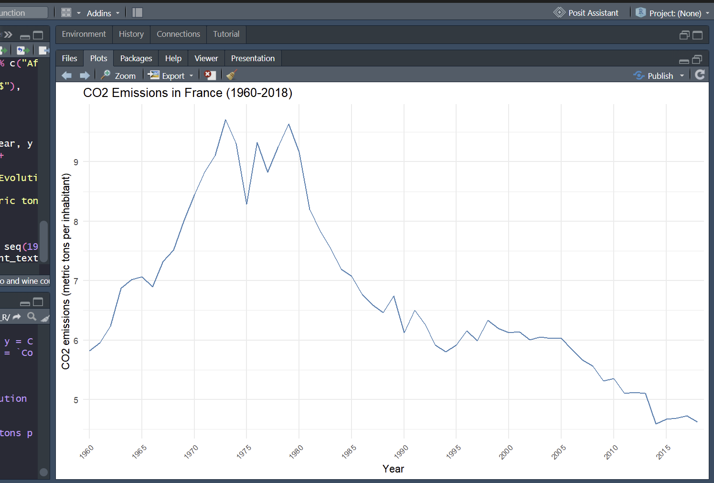
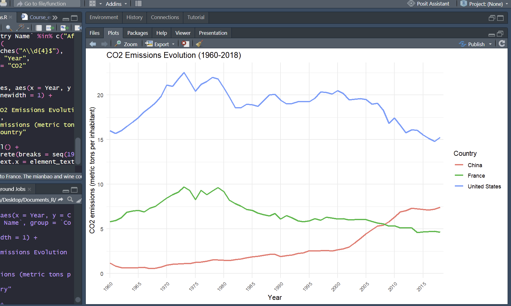

# CO2-emissions-analysis
CO2 emissions analysis using R and the tidyverse. 

You will find simple, detailed instructions there for generating a graph for a single country (plot1) or for comparing several countries (plot2).

**Dataset** :

- *Source*: [Kaggle – Life Expectancy at Birth Across the Globe](https://www.kaggle.com/datasets/iamsouravbanerjee/life-expectancy-at-birth-across-the-globe)
- *Coverage*: 266 entities (countries + regions), 1960–2018
- *Variables*: Country Name, Year (1960–2018 per 5 to 5), CO2 emissions (metric tons per inhabitant)

## How to use

1. Download the CSV file from Kaggle (link above)
2. Place it in a new folder.
3. Open `life_expectancy_analysis.R` in RStudio
   (An example is provided.)
4. Modify the countries according to your needs.
5. Run the script (Ctrl + Shift + Enter)
6. Two plots will appear in the Plots tab (bottom right)

To change the country: modify the line `filter(Country == "France")` in Plot 1.

To compare several countries: modify the list `("France", "China", "United States")` in Plot 2.

## Purpose

This project was made as a second step into data analysis with R, with the goal of sharing a simple, reusable script for teachers and textbook creators.

## Preview

### Plot 1: Single country

### Plot 2: Country comparison

## Tools :

- R (version 4.5.2)
- tidyverse (dplyr, tidyr, ggplot2)

I just imported the CSV dataset, reshaped the data from wide to long format using `pivot_longer()`(=66cols to 3cols) and visualised life expectancy trends over time with `ggplot2`.

## Author

**Simon Duramps**  
L1 Life Sciences – Université de Pau et des Pays de l'Adour (UPPA)

